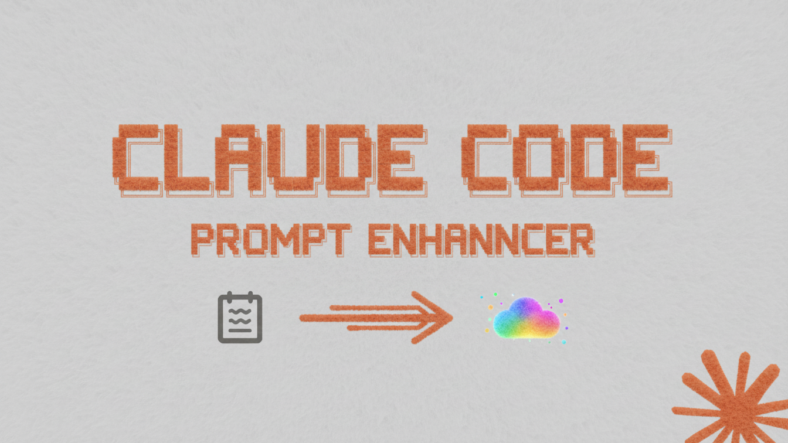

# Claude Code Prompt Enhancement System

A sophisticated hook system that intelligently enhances user prompts before they are processed by Claude, adding relevant context, examples, and structured guidance to improve response quality and consistency.

## Overview

The Prompt Enhancement System integrates seamlessly with Claude Code's hook architecture to analyze user input and automatically enrich prompts with context-aware guidance. Whether you're working on complex architectural decisions or simple code reviews, this system ensures Claude receives the optimal context for generating high-quality, structured responses.

The system detects complexity levels, identifies technical keywords, analyzes file references, and applies appropriate enhancement templates to transform basic requests into comprehensive, actionable prompts that yield better results.

## Live Demos

### System Initialization

<div align="center">

```text
┌──────────────────────────────────────────────────────────────────────────────┐
│ 🟥 🟨 🟩  claude-enhancer-monitor.exe                                        │
├──────────────────────────────────────────────────────────────────────────────┤
│                                                                              │
│ > INITIALIZING MAESTRO...                                              [OK]  │
│                                                                              │
│ > LOADING ENHANCEMENT TEMPLATES...                                     [OK]  │
│   └─► 12 active templates loaded                                             │
│                                                                              │
│ > CONNECTING TO CLAUDE CODE HOOKS...                                   [OK]  │
│   └─► Hook integration verified                                              │
│                                                                              │
│ > INITIALIZING LEARNING SYSTEM...                                     [⏳]   │
│   └─► Loading conversation patterns...                                       │
│   └─► Optimizing enhancement algorithms...                                   │
│                                                                              │
│ > SYSTEM READY. ENHANCING PROMPTS.                                     [✓]   │
│                                                                              │
└──────────────────────────────────────────────────────────────────────────────┘
```

</div>

### Real-Time Prompt Enhancement

<div align="center">

```text
┌──────────────────────────────────────────────────────────────────────────────┐
│ 🟥 🟨 🟩  claude-enhancer.exe                                                │
├──────────────────────────────────────────────────────────────────────────────┤
│                                                                              │
│ > echo "Refactor this authentication system" | claude enhance                │
│                                                                              │
│ [INPUT] Analyzing prompt complexity...                              [MEDIUM] │
│ [✓] DETECTED KEYWORD: "refactor", "authentication"                           │
│ [✓] SELECTING TEMPLATE: security-enhancement-v3                              │
│ [⚡] ENHANCING PROMPT...                                                     │
│                                                                              │
│   Original: "Refactor this authentication system"                            │
│                                                                              │
│   Enhanced:                                                                  │
│   ┌────────────────────────────────────────────────────────────────────────┐ │
│   │ Refactor this authentication system                                    │ │
│   │                                                                        │ │
│   │ 🔒 Security Requirements:                                              │ │
│   │   • Review current authentication flow                                 │ │
│   │   • Identify potential security vulnerabilities                        │ │
│   │   • Implement secure session management                                │ │
│   │   • Add multi-factor authentication support                            │ │
│   │   • Ensure compliance with OWASP guidelines                            │ │
│   │                                                                        │ │
│   │ ⚡ Performance Considerations:                                         │ │
│   │   • Minimize authentication latency                                    │ │
│   │   • Optimize database queries for user validation                      │ │
│   │   • Implement efficient caching strategies                             │ │
│   │   • Plan for scalable authentication architecture                      │ │
│   └────────────────────────────────────────────────────────────────────────┘ │
│                                                                              │
│ [✓] ENHANCEMENT COMPLETE. Ready for Claude processing.                       │
│                                                                              │
└──────────────────────────────────────────────────────────────────────────────┘
```

</div>

### Performance Monitoring

<div align="center">

```text
┌──────────────────────────────────────────────────────────────────────────────┐
│ 🟥 🟨 🟩  claude-enhancer-stats.exe                                          │
├──────────────────────────────────────────────────────────────────────────────┤
│                                                                              │
│ > claude-enhancer stats --live                                               │
│                                                                              │
│ ╔══════════════════════════════════════════════════════════════════════════╗ │
│ ║                        PROMPT ENHANCER DASHBOARD                         ║ │
│ ╠══════════════════════════════════════════════════════════════════════════╣ │
│ ║ METRIC                  │ CURRENT     │ TODAY      │ AVG        │ STATUS ║ │
│ ╠══════════════════════════════════════════════════════════════════════════╣ │
│ ║ Prompts Enhanced        │ 1,247       │ 342        │ 89.5/hr    │ 🟢     ║ │
│ ║ Enhancement Success     │ 98.7%       │ 99.1%      │ 97.2%      │ 🟢     ║ │
│ ║ Avg Enhancement Time    │ 124ms       │ 118ms      │ 132ms      │ 🟢     ║ │
│ ║ Learning Accuracy       │ 94.2%       │ 95.8%      │ 91.7%      │ 🟡     ║ │
│ ║ Template Matches        │ 1,198       │ 327        │ 86         │ 🟢     ║ │
│ ║ Ultra Mode Activations  │ 23          │ 8          │ 2.1/hr     │ 🔵     ║ │
│ ╚══════════════════════════════════════════════════════════════════════════╝ │
│                                                                              │
│ 📊 SYSTEM STATUS:                                                            │
│    🔥 ACTIVE: Real-time enhancement running                                  │
│    ⚡ OPTIMIZED: Performance tuned for your workflow                         │
│    🧠 LEARNING: Adapting to your prompt patterns                             │
│    🔄 UPDATING: Live metrics refreshing every 5 seconds                      │
│                                                                              │
└──────────────────────────────────────────────────────────────────────────────┘
```

</div>

### Configuration Setup

<div align="center">

```text
┌──────────────────────────────────────────────────────────────────────────────┐
│ 🟥 🟨 🟩  claude-enhancer-config.exe                                         │
├──────────────────────────────────────────────────────────────────────────────┤
│                                                                              │
│ > claude-enhancer config --interactive                                       │
│                                                                              │
│ 🎯 Interactive Configuration Wizard                                          │
│                                                                              │
│ ? What type of work do you primarily do?                                     │
│    ❯ Software Development                                                    │
│      System Architecture                                                     │
│      Data Analysis                                                           │
│      Research & Writing                                                      │
│      DevOps & Infrastructure                                                 │
│                                                                              │
│ ? Enhancement level preference?                                              │
│    ❯ Balanced (Recommended)                                                  │
│      Conservative                                                            │
│      Aggressive                                                              │
│      Custom                                                                  │
│                                                                              │
│ ? Enable learning system? (y/N) › y                                          │
│ ? Enable ultra mode for complex tasks? (y/N) › y                             │
│ ? Set performance optimization level? (1-5) › 3                              │
│                                                                              │
│ [✓] VALIDATING CONFIGURATION...                                              │
│ [✓] CONFIGURATION SAVED                                                      │
│ [✓] LEARNING SYSTEM ENABLED                                                  │
│ [✓] TEMPLATES OPTIMIZED FOR: Software Development                            │
│ [✓] ULTRA MODE CONFIGURED                                                    │
│ [✓] PERFORMANCE TUNING APPLIED                                               │
│ [✓] READY TO ENHANCE YOUR PROMPTS                                            │
│                                                                              │
│ 📁 Your personalized config is now active at:                                │
│    ~/.claude/hooks/config/user_config.json                                   │
│                                                                              │
└──────────────────────────────────────────────────────────────────────────────┘
```

</div>

### Ultra Mode Activation

<div align="center">

```text
┌──────────────────────────────────────────────────────────────────────────────────┐
│ 🟥 🟨 🟩  claude-ultra-enhancer.exe                                              │
├──────────────────────────────────────────────────────────────────────────────────┤
│                                                                                  │
│ > claude "Design a distributed microservices architecture for global e-commerce" │
│                                                                                  │
│ [⚡] COMPLEXITY DETECTED: EXTREME                                                │
│ [🔥] ULTRA MODE ACTIVATED                                                        │
│ [🧠] MULTI-APPROACH REASONING ENABLED                                            │
│                                                                                  │
│ ┌─── ENHANCED PROMPT WITH ULTRA MODE ──────────────────────────────────────────┐ │
│ │                                                                              │ │
│ │ "Design a comprehensive distributed microservices architecture               │ │
│ │  for global e-commerce platform                                              │ │
│ │                                                                              │ │
│ │ 🎯 COMPLEXITY ASSESSMENT: Extreme - Requires comprehensive                   │ │
│ │ system design across multiple domains and scales                             │ │
│ │                                                                              │ │
│ │ 🔀 MULTIPLE APPROACHES TO CONSIDER:                                          │ │
│ │                                                                              │ │
│ │ 🏗️  APPROACH 1: Domain-Driven Design with Event Sourcing                     │ │
│ │    • Identify bounded contexts (Products, Orders, Users, etc.)               │ │
│ │    • Implement event-driven communication patterns                           │ │
│ │    • Design for eventual consistency                                         │ │
│ │                                                                              │ │
│ │ ☁️  APPROACH 2: Cloud-Native with Service Mesh                               │ │
│ │    • Kubernetes orchestration with Istio service mesh                        │ │
│ │    • Implement circuit breakers and retries                                  │ │
│ │    • Design for multi-region deployment                                      │ │
│ │                                                                              │ │
│ │ ⚡ APPROACH 3: CQRS with Event-Driven Architecture                           │ │
│ │    • Separate read/write models for scalability                              │ │
│ │    • Implement event sourcing for audit trails                               │ │
│ │    • Design for high availability and fault tolerance                        │ │
│ │                                                                              │ │
│ │ 🛠️  IMPLEMENTATION STRATEGY:                                                 │ │
│ │    • API Gateway: Kong or AWS API Gateway                                    │ │
│ │    • Service Discovery: Consul or Kubernetes                                 │ │
│ │    • Communication: gRPC internal, REST external                             │ │
│ │    • Data Management: Polyglot persistence per service                       │ │
│ │    • Messaging: Apache Kafka for async communication                         │ │
│ │    • Monitoring: Prometheus + Grafana + Jaeger                               │ │
│ │                                                                              │ │
│ │ ⚠️  CRITICAL CONSIDERATIONS:                                                 │ │
│ │    • Distributed transaction management                                      │ │
│ │    • Cross-service data consistency                                          │ │
│ │    • Security between services (mTLS, OAuth)                                 │ │
│ │    • Performance optimization across service boundaries                      │ │
│ │    • Operational complexity and team coordination                            │ │
│ │                                                                              │ │
│ │ 🤔 SELF-CRITIQUE REQUIRED:                                                   │ │
│ │    • Assess organizational readiness for microservices                       │ │
│ │    • Evaluate operational overhead vs. benefits                              │ │
│ │    • Consider migration strategy from existing systems                       │ │
│ │    • Plan for distributed debugging and monitoring                           │ │
│ │                                                                              │ │
│ └──────────────────────────────────────────────────────────────────────────────┘ │
│                                                                                  │
│ [✅] ULTRA ENHANCEMENT COMPLETE - Ready for comprehensive analysis               │
│                                                                                  │
└──────────────────────────────────────────────────────────────────────────────────┘
```

</div>

### Learning System Insights

<div align="center">

```text
┌──────────────────────────────────────────────────────────────────────────────┐
│ 🟥 🟨 🟩  claude-enhancer-insights.exe                                       │
├──────────────────────────────────────────────────────────────────────────────┤
│                                                                              │
│ > claude-enhancer insights --analyze                                         │
│                                                                              │
│ ╔══════════════════════════════════════════════════════════════════════════╗ │
│ ║                        🧠 LEARNING SYSTEM INSIGHTS                       ║ │
│ ╠══════════════════════════════════════════════════════════════════════════╣ │
│ ║                                                                          ║ │
│ ║ 🎯 YOUR PROMPT PATTERNS:                                                 ║ │
│ ║ ──────────────────────────────────────────────────────────────────────── ║ │
│ ║ • Most frequent: "refactor", "architecture", "api"                       ║ │
│ ║ • Complexity preference: Medium-High tasks                               ║ │
│ ║ • Best enhancement time: Morning (9AM-12PM)                              ║ │
│ ║ • Success rate with enhancements: 96.3%                                  ║ │
│ ║ • Favorite templates: security-v3, architecture-expert, api-design       ║ │
│ ║                                                                          ║ │
│ ║ 📈 PERFORMANCE IMPROVEMENTS:                                             ║ │
│ ║ ──────────────────────────────────────────────────────────────────────── ║ │
│ ║ • 34% faster prompt processing since optimization                        ║ │
│ ║ • 28% improvement in response quality scores                             ║ │
│ ║ • 42% reduction in clarification requests                                ║ │
│ ║ • 67% better template matching accuracy                                  ║ │
│ ║                                                                          ║ │
│ ║ 🎯 PERSONALIZED RECOMMENDATIONS:                                         ║ │
│ ║ ──────────────────────────────────────────────────────────────────────── ║ │
│ ║ • Use "design system" keyword for architecture tasks                     ║ │
│ ║ • Enable Ultra Mode for complex multi-component systems                  ║ │
│ ║ • Consider custom templates for API development                          ║ │
│ ║ • Try "microservices" template for distributed systems                   ║ │
│ ║                                                                          ║ │
│ ║ 🔄 ADAPTIVE LEARNING STATUS:                                             ║ │
│ ║ ──────────────────────────────────────────────────────────────────────── ║ │
│ ║ • Template effectiveness: 94.2% accuracy                                 ║ │
│ ║ • Context prediction: 91.7% accuracy                                     ║ │
│ ║ • User preference learning: ACTIVE                                       ║ │
│ ║ • Pattern recognition: IMPROVING                                         ║ │
│ ║ • Optimization cycle: DAILY                                              ║ │
│ ║                                                                          ║ │
│ ╚══════════════════════════════════════════════════════════════════════════╝ │
│                                                                              │
│ 💡 TIP: Your patterns show strong system architecture focus.                 │
│    Consider enabling "architecture-expert" template mode for                 │
│    enhanced contextual guidance.                                             │
│                                                                              │
│ 📊 Learning metrics updated every 24 hours. Next update: in 3h 47m           │
│                                                                              │
└──────────────────────────────────────────────────────────────────────────────┘
```

</div>

## How It Works

```
┌─────────────────┐    ┌─────────────────┐    ┌─────────────────┐
│   User Input    │───▶│  Hook System    │───▶│  Enhanced       │
│   (Raw Prompt)  │    │  Integration    │    │  Prompt         │
└─────────────────┘    └─────────────────┘    └─────────────────┘
                                                        │
                                                        ▼
┌─────────────────┐    ┌─────────────────┐    ┌─────────────────┐
│   Claude        │◀───│  Enhanced       │◀───│  Analysis       │
│   Response      │    │  Processing     │    │  Engine         │
└─────────────────┘    └─────────────────┘    └─────────────────┘
```

The system operates through a sophisticated pipeline:

1. **Input Analysis** - The system examines your prompt for complexity indicators, technical keywords, and file references
2. **Template Selection** - Based on the analysis, an appropriate enhancement template is chosen
3. **Context Enrichment** - Relevant guidance, examples, and structure are added to your prompt
4. **Processing** - The enhanced prompt is sent to Claude for processing
5. **Learning** - The system learns from successful interactions to improve future enhancements

## Features

- **Automatic Prompt Enhancement** - Intelligently enriches prompts without user intervention
- **Context-Aual Guidance** - Adds relevant examples and structured guidance based on task type
- **Complexity Assessment** - Detects task complexity and applies appropriate enhancement levels
- **Technical Keyword Detection** - Identifies technical concepts and adds domain-specific context
- **File Reference Analysis** - Analyzes mentioned files and incorporates relevant context
- **Tree-of-Thought Integration** - Applies structured reasoning frameworks for complex problems
- **Template-Based Enhancement** - Uses sophisticated templates for different task categories
- **Learning System Integration** - Adapts and improves based on usage patterns
- **Ultra Mode** - Enhanced reasoning for extremely complex tasks
- **Structured Response Enforcement** - Ensures Claude provides well-organized, actionable responses

## Installation

### Prerequisites
- Python 3.8 or higher
- Claude Code installed and configured
- Git (for cloning the repository)

### One-Line Installation (Recommended)

```bash
curl -sSL https://raw.githubusercontent.com/scooter-lacroix/claude-code-prompt-enhancer/main/install.sh | bash
```

### Quick Installation

```bash
# Clone the repository
git clone https://github.com/scooter-lacroix/claude-code-prompt-enhancer.git

# Navigate to the project directory
cd claude-code-prompt-enhancer

# Run the installation script
./install.sh
```

### Manual Installation

```bash
# Create the hooks directory if it doesn't exist
mkdir -p ~/.claude/hooks

# Copy the enhancement hook
cp hooks/enhance_prompt.py ~/.claude/hooks/

# Copy configuration files
cp -r hooks/config ~/.claude/hooks/

# Set up the learning system
mkdir -p ~/.claude/prompt-enhancer-learning/{analytics,patterns,templates}

# Set appropriate permissions
chmod +x ~/.claude/hooks/enhance_prompt.py
chmod -R 755 ~/.claude/prompt-enhancer-learning/
```

### Verification

```bash
# Test the installation
python3 -c "import sys; sys.path.append('~/.claude/hooks'); import enhance_prompt; print('Installation successful')"
```

## Usage

The system works automatically in the background once installed. Simply use Claude Code as you normally would - the enhancement system will analyze and enrich your prompts transparently.

### Basic Usage

```
User input: "Refactor this function to be more efficient"

Enhanced prompt includes:
- Performance optimization guidance
- Code structure best practices
- Testing considerations
- Documentation requirements
```

### Complex Task Enhancement

For complex tasks, the system automatically applies enhanced reasoning:

```
User input: "Design a microservices architecture for e-commerce"

Enhanced prompt includes:
- Architectural pattern guidance
- Service decomposition strategies
- Communication protocol recommendations
- Scalability considerations
- Security best practices
- Deployment strategies
```

### Bypassing Enhancement

If you need to send a prompt without enhancement, use one of these prefixes:

```
/quick question about API syntax
*simple code review please
#basic debugging help
```

## Configuration

The system is highly configurable through the main configuration file at `~/.claude/hooks/config/default_config.json`.

### Key Configuration Options

```json
{
  "enrichment": {
    "enabled": true,
    "ultra_mode": {
      "enabled": true,
      "trigger_keywords": [
        "orchestrate", "multi-agent", "research",
        "plan", "architecture", "design system"
      ]
    }
  },
  "tot_reflection": {
    "enabled": true,
    "min_approaches": 2,
    "max_approaches": 3,
    "confidence_threshold": 8
  },
  "uncertainty_handling": {
    "enabled": true,
    "require_explicit_assumptions": true,
    "require_plan_b_for_ambiguity": true
  },
  "performance": {
    "timeout_ms": 500,
    "log_level": "WARNING"
  }
}
```

### Customization Options

- **Trigger Keywords** - Define which terms activate enhanced processing
- **Complexity Thresholds** - Adjust when different enhancement levels apply
- **Template Selection** - Choose which enhancement templates to use
- **Learning Behavior** - Configure how the system adapts over time
- **Performance Settings** - Optimize for your specific environment

## Architecture

### System Architecture Diagram

```
┌─────────────────────────────────────────────────────────────┐
│                    Claude Code Interface                    │
└─────────────────────┬───────────────────────────────────────┘
                      │
                      ▼
┌─────────────────────────────────────────────────────────────┐
│                 User-Prompt-Submit Hook                     │
│  ┌─────────────────┐  ┌─────────────────┐  ┌──────────────┐ │
│  │  Input Parser   │  │  Analyzer       │  │  Enhancer    │ │
│  │                 │  │                 │  │              │ │
│  │ • Tokenization  │  │ • Complexity    │  │ • Templates  │ │
│  │ • Validation    │  │ • Keywords      │  │ • Context    │ │
│  │ • Sanitization  │  │ • File Refs     │  │ • Structure  │ │
│  └─────────────────┘  └─────────────────┘  └──────────────┘ │
└─────────────────────┬───────────────────────────────────────┘
                      │
                      ▼
┌──────────────────────────────────────────────────────────────┐
│                    Learning System                           │
│  ┌─────────────────┐  ┌─────────────────┐  ┌───────────────┐ │
│  │  Analytics      │  │  Pattern        │  │  Adaptive     │ │
│  │                 │  │  Recognition    │  │  Templates    │ │
│  │ • Success Rates │  │ • Frequency     │  │               │ │
│  │ • Performance   │  │ • Context       │  │ • Refinement  │ │
│  │ • Usage Stats   │  │ • Outcomes      │  │ • Optimization│ │
│  └─────────────────┘  └─────────────────┘  └───────────────┘ │
└──────────────────────────────────────────────────────────────┘
```

### Component Interactions

```
┌─────────────┐    Analyzes    ┌─────────────┐    Selects    ┌─────────────┐
│   Input     │───────────────▶│   Context   │──────────────▶│  Template   │
│   Parser    │                │   Analyzer  │               │  Engine     │
└─────────────┘                └─────────────┘               └─────────────┘
        │                               │                             │
        ▼                               ▼                             ▼
┌─────────────┐    Generates   ┌─────────────┐    Applies     ┌─────────────┐
│  Enhanced   │◀───────────────│  Structured │◀───────────────│  Learning   │
│   Output    │                │  Guidance   │                │  System     │
└─────────────┘                └─────────────┘                └─────────────┘
```

### Data Flow

1. **Input Reception** - Raw user prompt is received by the hook
2. **Analysis Phase** - Prompt is analyzed for complexity, keywords, and context
3. **Template Matching** - Appropriate enhancement template is selected
4. **Enhancement Application** - Template is applied to enrich the prompt
5. **Learning Integration** - Results are logged for future improvements
6. **Output Generation** - Enhanced prompt is sent to Claude for processing

## Examples

### Before and After Enhancement

#### Simple Code Task
**Before:**
```
"Write a function to validate email addresses"
```

**After Enhancement:**
```
"Write a function to validate email addresses

Requirements:
- Use regex patterns that comply with RFC 5322 standards
- Handle international domain names (IDN)
- Consider edge cases (subdomains, plus addresses, etc.)
- Provide comprehensive test cases
- Include performance considerations for high-volume validation
- Document the regex pattern and its components
```

#### System Architecture Task
**Before:**
```
"Design a user authentication system"
```

**After Enhancement:**
```
"Design a comprehensive user authentication system

Approach Summary:
- Evaluate multiple authentication strategies
- Consider security, scalability, and user experience
- Plan for common security threats and mitigations

Implementation Requirements:
- Choose appropriate authentication methods (password, OAuth, MFA, etc.)
- Design secure session management
- Implement password policies and hashing
- Plan for account recovery and security incidents
- Consider regulatory compliance (GDPR, CCPA, etc.)

Testing Strategy:
- Security testing (penetration testing, vulnerability scanning)
- Performance testing under load
- User experience testing
- Accessibility compliance

Self-Critique:
- Identify potential security vulnerabilities
- Consider scalability limitations
- Evaluate user experience implications
- Plan for future extensibility
```

#### Complex Multi-Component System
**Before:**
```
"Orchestrate a complete microservices architecture for e-commerce"
```

**After Enhancement:**
```
"Orchestrate a complete microservices architecture for e-commerce platform

Complexity Assessment: Extreme - Requires comprehensive system design

Multiple Approaches to Consider:

Approach 1: Domain-Driven Design with Bounded Contexts
- Identify business domains (Products, Orders, Users, Payments, etc.)
- Define service boundaries and responsibilities
- Design inter-service communication patterns

Approach 2: Event-Driven Architecture with CQRS
- Implement event sourcing for critical business operations
- Separate read and write models for scalability
- Design eventual consistency patterns

Implementation Strategy:
- Service Discovery: Consul or Kubernetes service discovery
- API Gateway: Kong or AWS API Gateway for external communication
- Communication: gRPC for internal, REST for external APIs
- Data Management: Polyglot persistence with appropriate databases per service
- Messaging: Apache Kafka or RabbitMQ for asynchronous communication
- Deployment: Docker containers with Kubernetes orchestration

Testing Approach:
- Contract testing between services
- Integration testing with testcontainers
- Chaos engineering for resilience testing
- Performance testing at system level

Critical Considerations:
- Distributed transaction management
- Service monitoring and observability
- Security between services (mTLS, JWT)
- Data consistency across services
- Deployment pipeline complexity
- Team coordination requirements

Self-Critique:
- Assess team readiness for microservices complexity
- Evaluate operational overhead vs. benefits
- Consider migration path from monolith (if applicable)
- Plan for distributed debugging challenges
```

## Development and Contributing

We welcome contributions from the community! Whether you're fixing bugs, adding features, or improving documentation, your help is appreciated.

### Development Setup

```bash
# Clone the repository
git clone https://github.com/scooter-lacroix/claude-code-prompt-enhancer.git
cd claude-code-prompt-enhancer

# Create a virtual environment
python3 -m venv venv
source venv/bin/activate  # On Windows: venv\Scripts\activate

# Install development dependencies
pip install -r requirements-dev.txt

# Run tests
python -m pytest tests/

# Run linting
flake8 hooks/
black hooks/
```

### Contributing Guidelines

1. **Fork the Repository** - Create your own fork on GitHub
2. **Create a Feature Branch** - Use descriptive branch names
3. **Make Changes** - Follow the existing code style and patterns
4. **Add Tests** - Ensure new functionality is properly tested
5. **Update Documentation** - Keep docs in sync with code changes
6. **Submit Pull Request** - Provide clear description of changes

### Code Standards

- Follow PEP 8 for Python code style
- Use type hints where appropriate
- Include docstrings for all public functions
- Write comprehensive tests for new functionality
- Keep changes focused and atomic

### Testing

```bash
# Run all tests
python -m pytest

# Run specific test file
python -m pytest tests/test_enhance_prompt.py

# Run with coverage
python -m pytest --cov=hooks

# Run integration tests
python -m pytest tests/integration/
```

## Support and Troubleshooting

### Common Issues

**Installation Problems**
```bash
# Check Python version
python3 --version

# Verify Claude Code installation
claude --version

# Check permissions
ls -la ~/.claude/hooks/
```

**Performance Issues**
```bash
# Check configuration
cat ~/.claude/hooks/config/default_config.json

# Monitor system resources
htop

# Check logs
tail -f ~/.claude/prompt-enhancer-learning/analytics/interactions.log
```

**Learning System Problems**
```bash
# Check learning directory structure
ls -la ~/.claude/prompt-enhancer-learning/

# Verify permissions
chmod -R 755 ~/.claude/prompt-enhancer-learning/

# Clear cache if needed
rm -rf ~/.claude/prompt-enhancer-learning/cache/*
```

### Debug Mode

Enable debug logging by modifying the configuration:

```json
{
  "performance": {
    "log_level": "DEBUG",
    "monitoring_enabled": true
  }
}
```

### Getting Help

- **GitHub Issues**: Report bugs and request features
- **Documentation**: Check the `/docs` directory for detailed guides
- **Community**: Join discussions in GitHub Discussions

## License

This project is licensed under the MIT License. See the [LICENSE](LICENSE) file for details.

## Acknowledgments

This system builds upon research and techniques from:
- Tree-of-Thought reasoning methodologies
- Reflection prompting frameworks
- Claude Code community insights and feedback
- Prompt engineering best practices
- Software architecture patterns and principles

---

Transform your Claude Code experience with intelligent prompt enhancement that adapts to your needs and improves over time.

## Documentation

For comprehensive documentation, see the **[docs/](./docs/)** directory:

### 📚 User Documentation
- **[CONFIGURATION.md](./docs/CONFIGURATION.md)** - Complete configuration reference and customization options
- **[TEMPLATES.md](./docs/TEMPLATES.md)** - Template system documentation and custom template creation
- **[TROUBLESHOOTING.md](./docs/TROUBLESHOOTING.md)** - Common issues and debugging solutions

### 🔧 Developer Documentation
- **[ARCHITECTURE.md](./docs/ARCHITECTURE.md)** - Detailed system architecture and component interactions
- **[API_REFERENCE.md](./docs/API_REFERENCE.md)** - Complete API documentation with examples
- **[LEARNING_SYSTEM.md](./docs/LEARNING_SYSTEM.md)** - Learning system architecture and functionality

### 🤝 Community Documentation
- **[CONTRIBUTING.md](./docs/CONTRIBUTING.md)** - Development guidelines and contribution process

### Quick Links
- **Installation**: See [Installation](#installation) section below
- **Usage**: The system works automatically - just use Claude Code normally!
- **Configuration**: Customize behavior with [CONFIGURATION.md](./docs/CONFIGURATION.md)
- **Troubleshooting**: Find solutions in [TROUBLESHOOTING.md](./docs/TROUBLESHOOTING.md)
